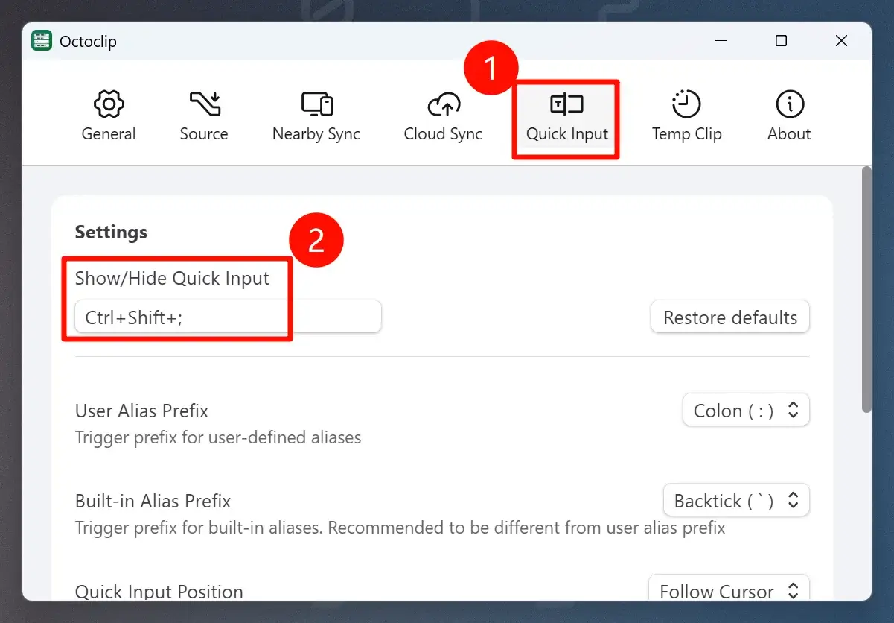

# {{ $frontmatter.title }} <PlatformBadge platform="Windows" text="Windows 10+" />

## Why Replace It?

The native **Win + V Clipboard History** in Windows is limited.
It only stores a small number of items locally and doesn’t work across devices.

**Octoclip** provides a more powerful solution:

- Full **clipboard history**
- Cross-device sync (Nearby Sync, Cloud Sync)
- Favorites and Aliases
- Quick search and input

By remapping **Win + V** to Octoclip, you can enjoy a seamless clipboard experience.

## Method Comparison

| Method| Recommended | Best For | Features |
|---------------|-------------|----------|----------|
| **PowerToys** | ⭐⭐⭐⭐⭐ | Normal users | Easy to install, GUI-based, stable |
| **AutoHotKey** | ⭐⭐⭐ | Advanced users | More flexible, script-based, requires manual setup |

## Method 1: PowerToys (Recommended)

### Step 1: Install PowerToys

Download from the **Microsoft Store** or via [this link](https://aka.ms/installpowertoys).

### Step 2: Remap Win+V

Open **Keyboard Manager** → “Remap Shortcut”.

1. Set `Win + v` as the **key to be replaced**.
2. Map it to your **Octoclip Clipboard Shortcut**.

::: details Where to find the Octoclip shortcut?

:::

Now pressing `Win + v` will open Octoclip instead of Windows Clipboard History.

## Method 2: AutoHotKey (Advanced)

### Step 1: Install AutoHotKey

Download from the [official website](https://www.autohotkey.com/).

### Step 2: Create the Script

Select your Octoclip shortcut below and click **Generate Script**.
Or create a `.ahk` file manually and paste the code.

<ShortcutConverter lang="en" />

Run the script. A green **H icon** will appear in the taskbar.
Now `Win + v` is redirected to Octoclip.

::: tip Safety Note
The script only contains simple key remapping, no system-level modifications. It’s safe to use.
:::

::: details Key symbol reference

| Symbol | Key | Description |
|--------|-------|-------------|
| `^`| Ctrl| Control key |
| `+`| Shift | Shift key |
| `!`| Alt | Alt key |
| `#`| Win | Windows logo key |

:::

### Step 3: Auto Start on Boot (Optional)

Press `Win + R`, type `shell:startup`, and copy the script into the folder.

## How to Restore Default Win+V

- **PowerToys**: Delete the remapping.
- **AutoHotKey**: Close or delete the script.

This restores the native Windows Clipboard History.

## FAQ

**Q: Win+V doesn’t work after setup?**

A: Ensure PowerToys or the AHK script is running. Check for conflicts.

**Q: Can I still keep the original Clipboard History?**

A: Yes. You can remap it to `Ctrl + Win + V` if you want both.

**Q: Does it affect other shortcuts?**

A: No, only `Win + V` is modified.

---

::: info Author Note
This article was contributed by Octoclip community user **@wwxiaoqi**. Thanks for sharing!
:::
