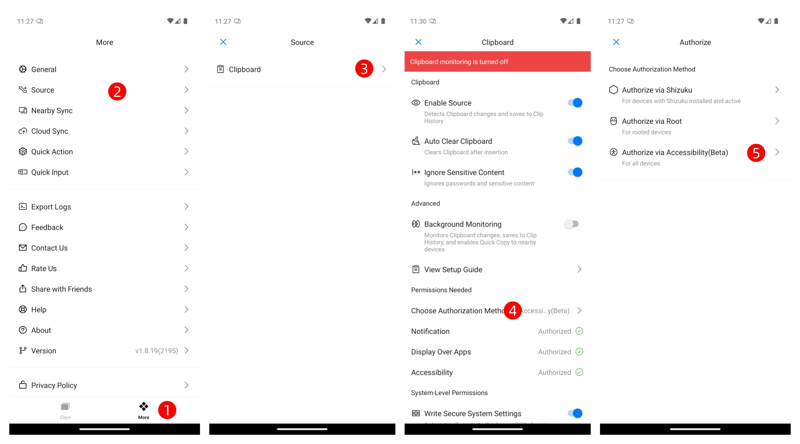
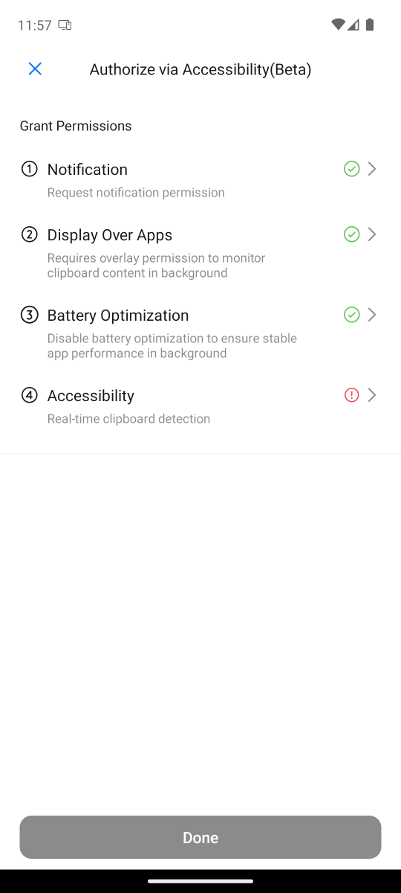

# Enabling Background Clipboard Monitoring (Accessibility Mode)

This document describes how to enable background clipboard monitoring in **Octoclip**  
using the **Accessibility Service**, without requiring root privileges.

## Configuration Procedure

Go to **Octoclip → More → Source → Clipboard → Choose Authorization Method**.  
The system will automatically navigate to the **Choose Authorization Method** screen.  

Select **Authorize via Accessibility(Beta)** to begin the setup process.  

Follow the on-screen instructions to complete the following steps:

1. **Grant the Required Permissions**  
   - Notification  
   - Display Over Apps
   - Battery Optimization  
   - Accessibility

   

2. After all permissions are granted, tap **Done** to activate clipboard monitoring.  

3. Enable the **Background Monitoring** switch to start background clipboard monitoring.  

   

## Function Verification

1. Return to the Octoclip main screen.  
2. Copy any text in another application.  
3. Reopen Octoclip and confirm whether the clipboard content was successfully captured.  

## FAQ

**Q: Accessibility Service is enabled, but some copied content is not being captured.**  
Clipboard monitoring in Accessibility Mode is triggered by system accessibility events.  
Since some copy operations do not generate recognizable accessibility events,  
certain copy actions may not be detected.  
This is a normal limitation of the system mechanism.

## Conclusion

In **Accessibility Authorization Mode**, Octoclip provides stable and reliable background clipboard monitoring.  
This method requires neither root access nor command-line operations, offering simple configuration and wide compatibility.  
Due to system limitations, a small portion of copy actions may not be fully captured; this behavior is considered normal.
