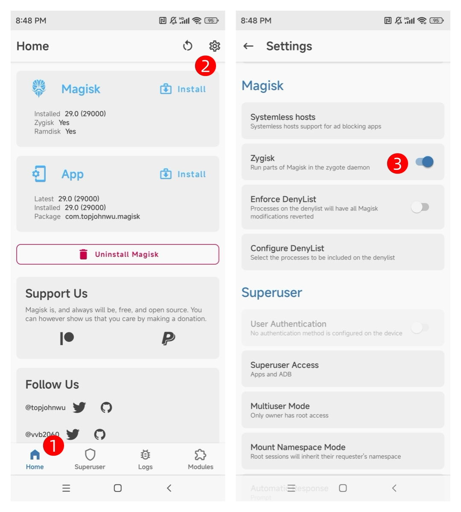
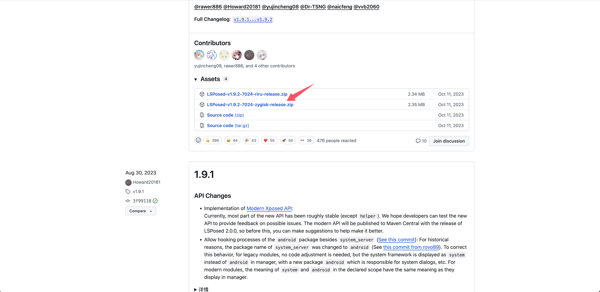
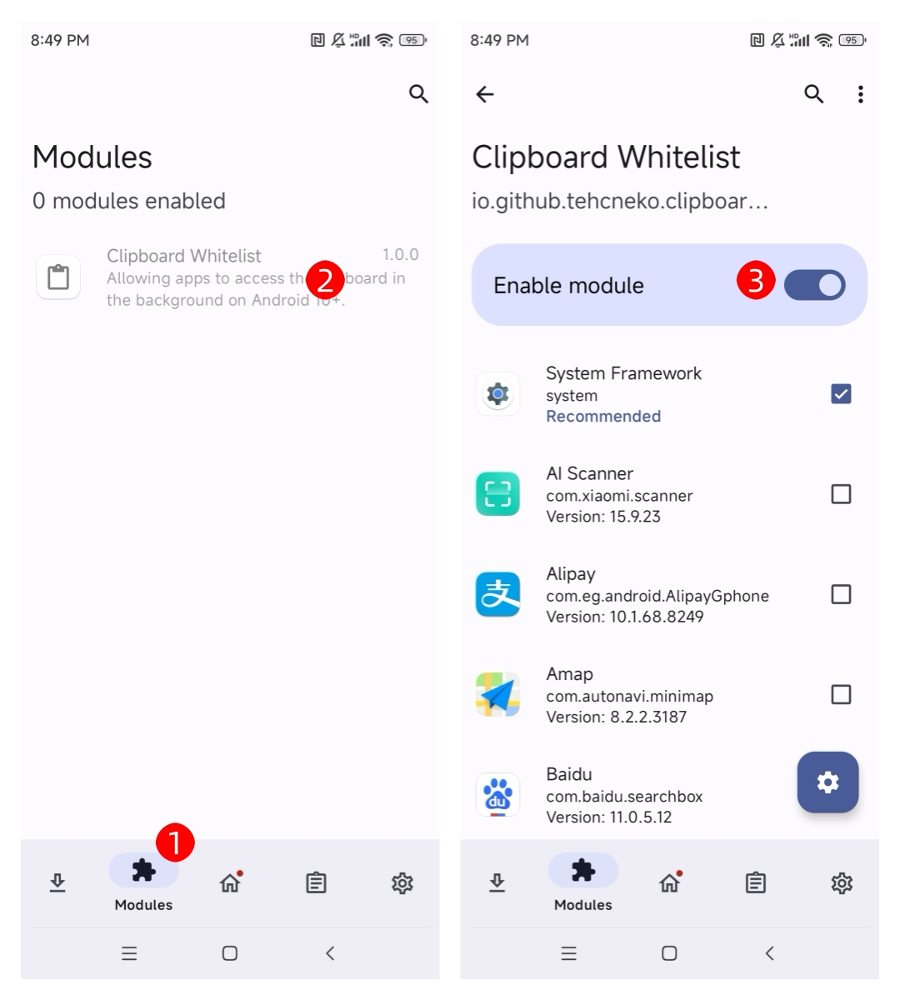
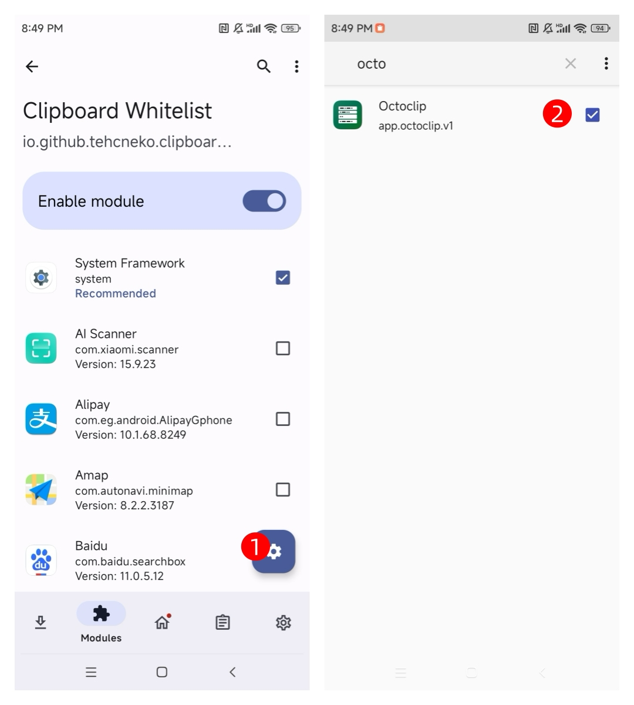
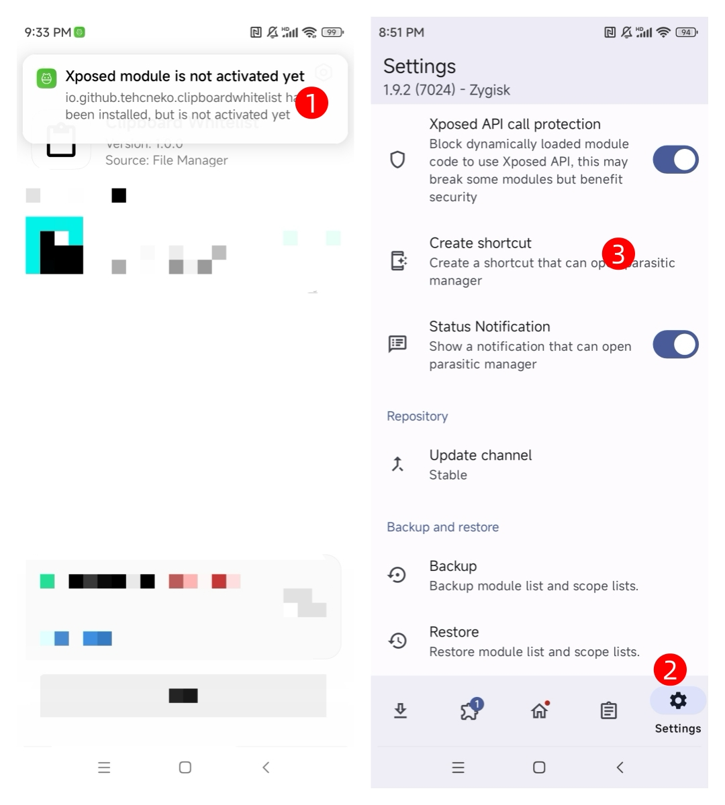

# Enable Clipboard Background Monitoring (Root)

This guide will help Rooted users enable clipboard background monitoring by installing **LSPosed** and the **Clipboard Whitelist** module.

## Prerequisites

> Required conditions

- Device must be **Rooted** and have **Magisk v24.0** or higher installed  
- **Zygisk** must be enabled in Magisk settings  
- **Octoclip** app must be installed  

::: details Check if prerequisites are met

1. Open the **Magisk** app and confirm it shows "Installed"  
2. Go to **Home** → Verify that the **Zygisk** switch is enabled  
3. Restart the device to activate Zygisk  

:::

## Install the “LSPosed” Framework

### Download the framework

You can download it from the [GitHub release page](https://github.com/LSPosed/LSPosed/releases), or directly from [here](https://github.com/LSPosed/LSPosed/releases/download/v1.9.2/LSPosed-v1.9.2-7024-zygisk-release.zip).  

### Install the framework

1. Open the **Magisk** app  
2. Switch to the **Modules** tab  
3. Tap **Install from storage**, then select the downloaded LSPosed `.zip` file  
4. Wait for the installation to complete, then tap **Reboot**  

## Install the “Clipboard Whitelist” Module

### Download the module

You can get it from the [GitHub release page](https://github.com/Xposed-Modules-Repo/io.github.tehcneko.clipboardwhitelist/releases), or download it directly from [here](https://github.com/Xposed-Modules-Repo/io.github.tehcneko.clipboardwhitelist/releases/download/1-1.0.0/app-release.apk).  

### Enable the module

Once installed, go to the **Modules** page in the LSPosed manager and enable the module.  

## Configure the App Whitelist

1. Open the **Clipboard Whitelist** app  
2. Find and check **Octoclip**  

::: warning App list permission notice
If the app list is not displayed in Clipboard Whitelist, you need to:  

- Go to **System Settings → App Management → Clipboard Whitelist → Permissions**  
- Enable **Get app list** or **Read app info** permission  
:::

## Reboot and Verify

1. **Reboot your device** to apply the configuration  
2. Open the **Octoclip** app  
3. Switch to any other app and copy some text  
4. Return to Octoclip and check if it automatically captured the clipboard content  

## FAQ

**Q: The module is installed but not working?**

A: Please check the following:  

1. Confirm Zygisk is enabled and the device has been restarted  
2. Ensure the **Clipboard Whitelist** module is enabled in LSPosed Manager  
3. Verify **Octoclip** is selected in **two places**:  
   - LSPosed module scope  
   - Clipboard Whitelist app  
4. Try clearing Octoclip app data and reconfiguring it  
5. Ensure Octoclip has clipboard access permission  

---

**Q: LSPosed installation failed?**

Possible causes:  

- Magisk version too low (requires v24.0+)  
- Zygisk not properly enabled  

Solution:  

1. Update Magisk to the latest version  
2. Re-enable Zygisk and fully reboot the device  

---

**Q: LSPosed icon not showing?**

Steps to fix:  

1. After installing the Clipboard Whitelist APK, tap the prompt to open the LSPosed module  
2. Inside LSPosed, switch to the **Settings** tab  
3. Tap **Create shortcut** to add the LSPosed icon to your home screen  

---

**Q: Clipboard Whitelist not showing app list?**

Solution:  

1. Open **System Settings → App Management → Clipboard Whitelist**  
2. Tap **Permission Management**  
3. Enable **Get app list** or **Read app info** permission  
4. Relaunch the Clipboard Whitelist app
