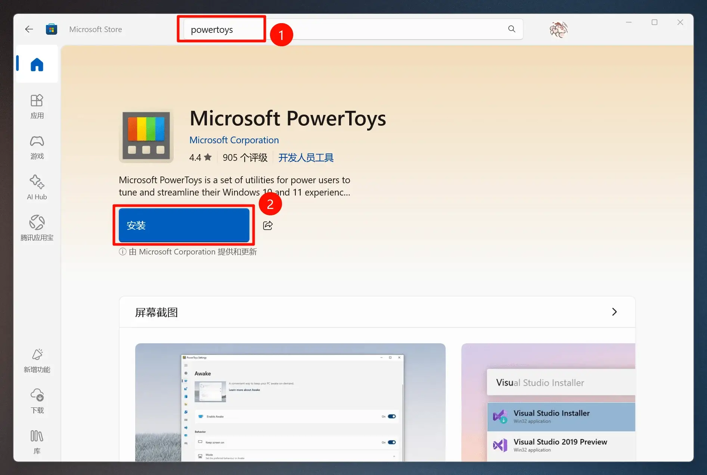
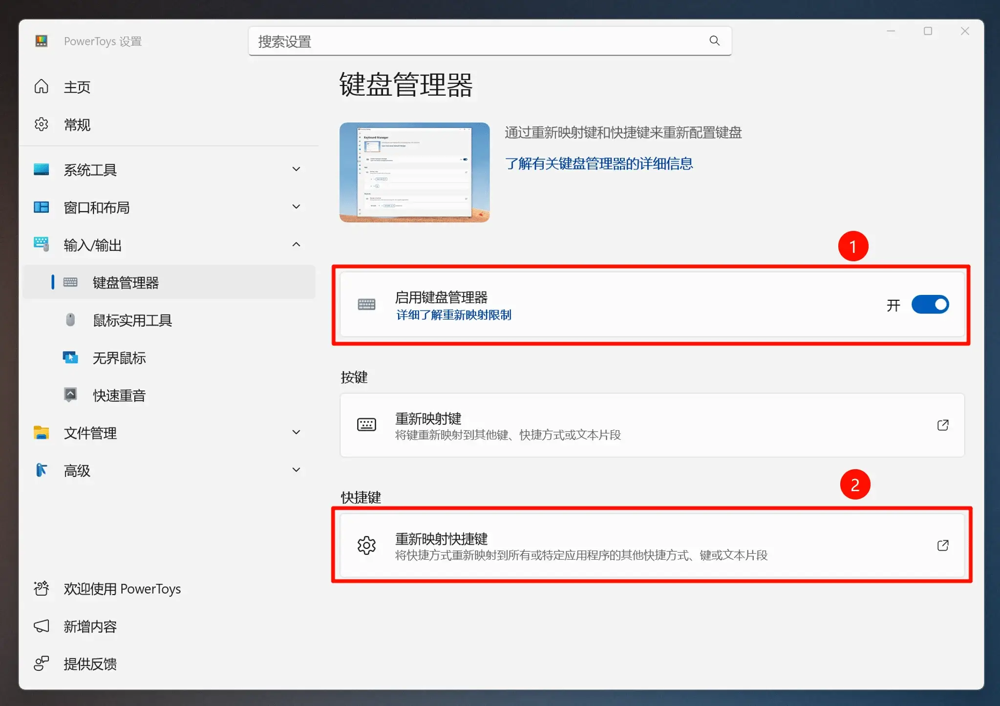
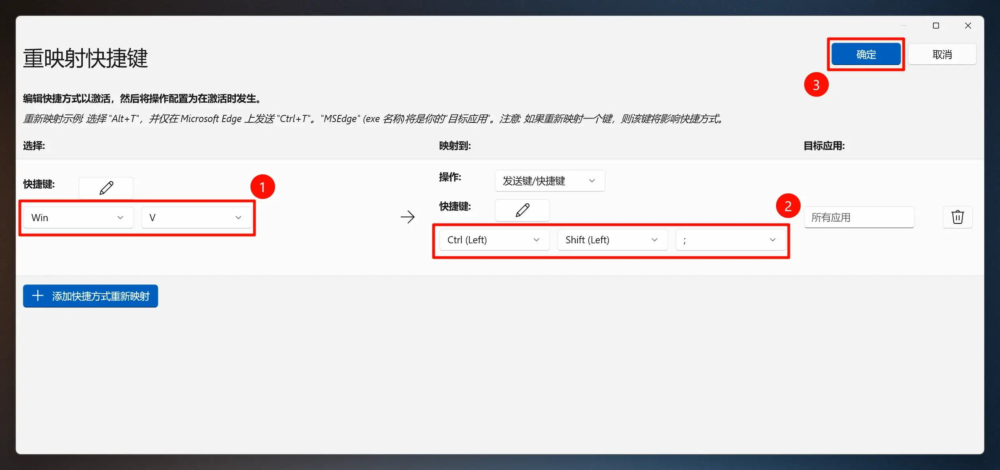
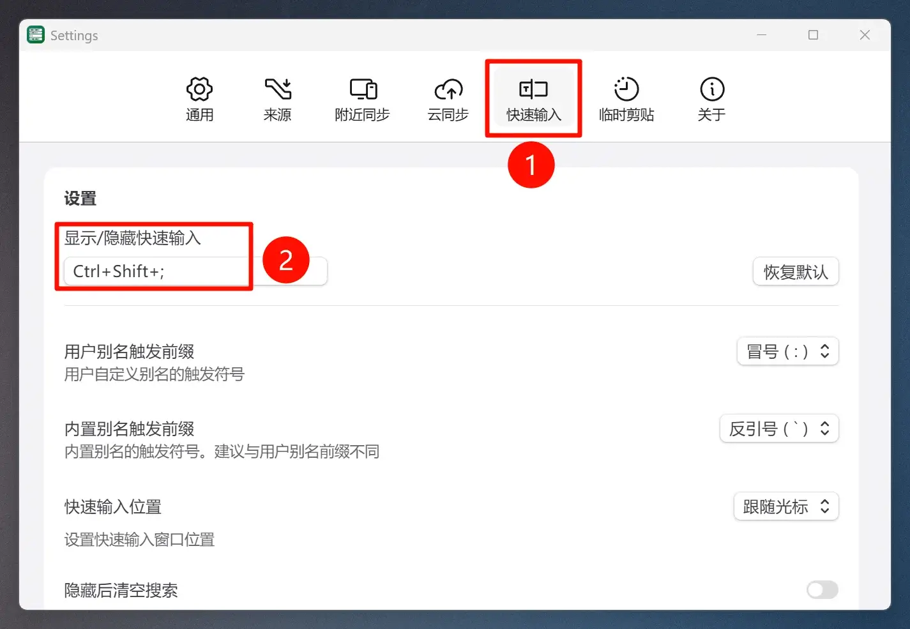
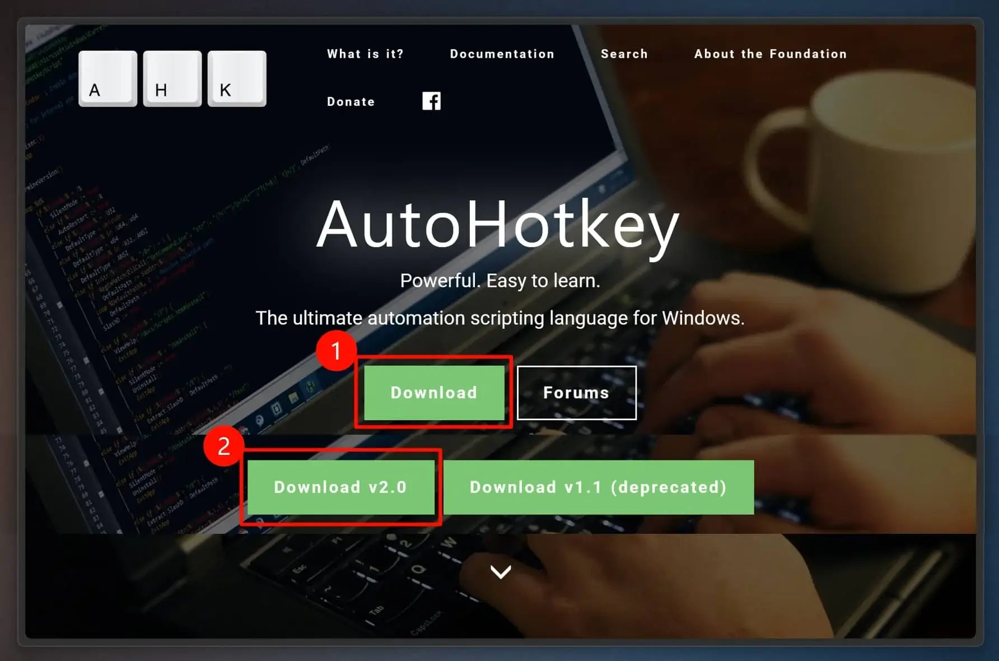
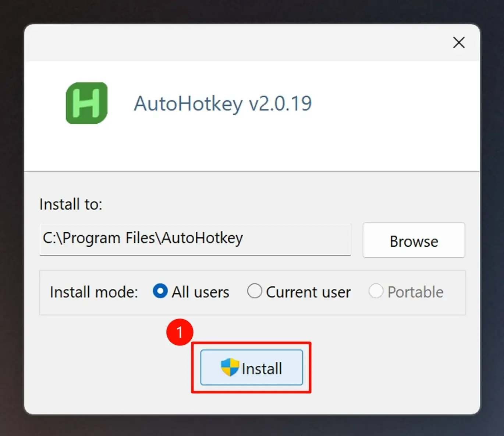
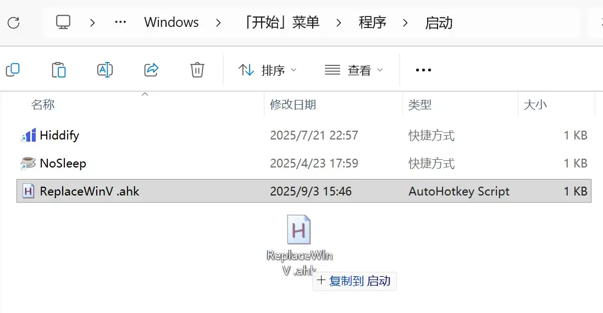

# {{ $frontmatter.title }} <PlatformBadge platform="Windows" text="Windows 10+" />

## 为什么要替换？

Windows 自带的 **Win + V 剪贴板历史** 功能有限，只能在本机保存少量内容，无法跨设备使用。
使用 **章鱼速贴** 可以获得更强大的功能：

- 完整的 **剪贴历史**
- 跨设备同步（附近同步、云同步）
- 收藏与别名
- 快捷搜索与输入

因此，我们推荐将 **Win + V** 快捷键替换为 章鱼速贴 的触发键，获得更顺畅的体验。

## 方法对比

| 方法| 推荐程度 | 适合人群 | 特点 |
|-------------|----------|----------|------|
| **PowerToys** | ⭐⭐⭐⭐⭐ | 普通用户 | 安装简单，界面配置，无需脚本，稳定推荐 |
| **AutoHotKey** | ⭐⭐⭐ | 高级用户 | 灵活可定制，需要脚本，适合熟悉快捷键映射的用户 |

## 使用 PowerToys（推荐）

### 第一步：下载安装 PowerToys

你可以直接在 **Windows 应用商店** 找到它，或者通过 [此处](https://aka.ms/installpowertoys) 下载。

### 第二步：配置键盘管理器

安装完毕后，打开 **Keyboard Manager** 功能，进入「重映射快捷键」选项。

配置步骤：

1. 将 `Win + v` 作为 **被替换键位**
2. 将 **替换结果** 配置为你的 **章鱼速贴 剪贴板快捷触发键**

::: details 剪贴板快捷触发键在哪？

:::

完成后，你的 `Win + V` 就会直接触发 章鱼速贴 的剪贴板历史啦。

## 使用 AutoHotKey（进阶）

### 第一步：下载并安装 AutoHotKey

到 [AutoHotKey 官方网站](https://www.autohotkey.com/) 下载安装。

### 第二步：生成脚本

在下方选择你的 章鱼速贴 剪贴板快捷键，点击【一键下载生成脚本】。
也可以手动新建一个 `.ahk` 文件并粘贴内容。

<ShortcutConverter lang="zh" />

运行脚本后，任务栏会出现绿色的 **H 图标**，表示脚本运行中。
此时 `Win + V` 就会触发 章鱼速贴。

::: tip 安全提示
生成的脚本只包含简单的快捷键映射，不会修改系统配置，请放心使用。
:::

::: details 按键符号对照表

| 符号 | 对应按键 | 说明 |
|------|----------|------|
| `^`| Ctrl | Control 键 |
| `+`| Shift| Shift 键 |
| `!`| Alt| Alt 键 |
| `#`| Win| Windows 徽标键 |

:::

### 第三步：设置开机自启（可选）

按 `Win + R` 输入 `shell:startup`，回车后打开启动文件夹。
将 `.ahk` 脚本复制进去即可。

## 如何恢复默认 Win+V

- **PowerToys**：删除对应映射即可
- **AutoHotKey**：关闭或删除 `.ahk` 脚本即可

这样就会恢复 Windows 原生的剪贴板历史。

## 常见问题（FAQ）

**Q: 为什么 Win+V 没反应？**

A: 确认 PowerToys/脚本正在运行，并检查是否与其他快捷键冲突。

**Q: 我还能保留原生的 Win+V 吗？**

A: 可以。你可以把原生功能改到 `Ctrl + Win + V`，两者并存。

**Q: 会影响其他快捷键吗？**

A: 不会，只修改了 Win+V。

---

::: info 作者说明
本文由 章鱼速贴 社区用户 **@wwxiaoqi** 投稿，感谢对社区的贡献。
:::
