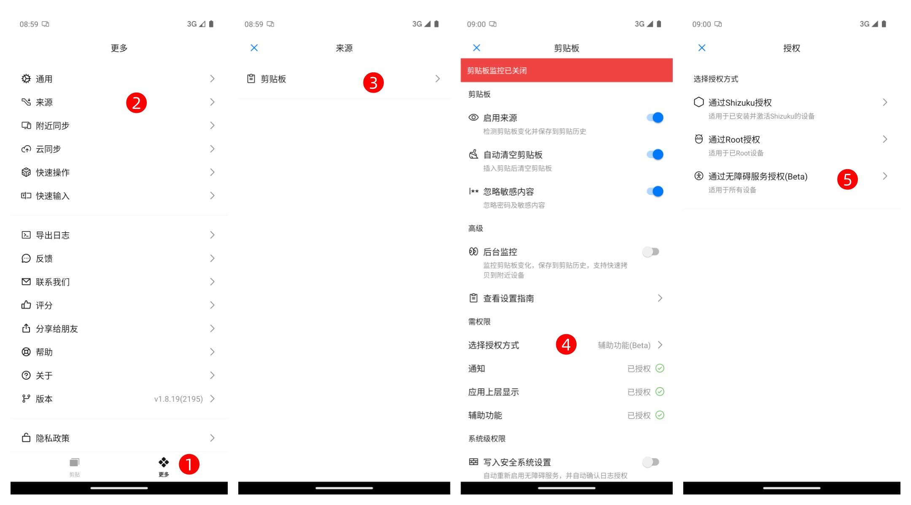
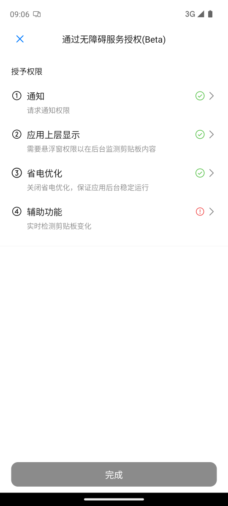
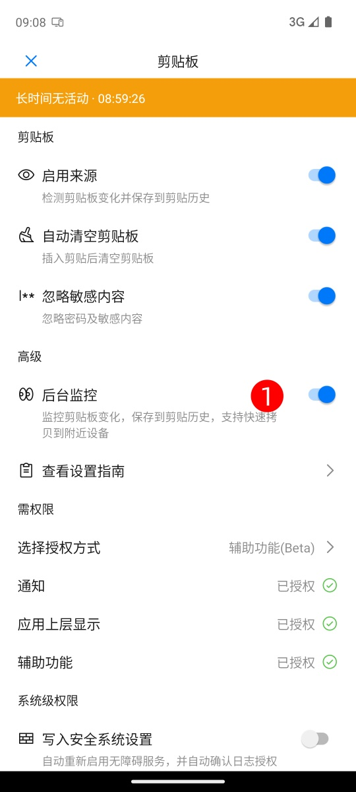

# 启用剪贴板后台监听（无障碍模式）

本文档说明如何通过 **无障碍服务** 的方式，  
在无需 Root 权限的情况下启用章鱼速贴的后台剪贴板监听功能。

## 配置流程

进入 **章鱼速贴 → 更多 → 来源 → 剪贴板 → 选择授权方式**，  
系统将自动跳转至「选择授权方式」界面。  

选择 **通过无障碍服务授权** 以进入设置流程。  

按照应用提示依次完成以下步骤：

1. **授予必要权限**  
   - 通知权限
   - 应用上层显示权限
   - 关闭电池优化  
   - 启用应用的辅助功能权限  

   

2. 完成全部授权后，点击 **完成** 激活剪贴板监听功能。  

3. 启用 **后台监控** 开关，以开启后台剪贴板监控功能。  

   

## 功能验证

1. 返回章鱼速贴主界面；  
2. 在任意应用中复制文本；  
3. 再次进入章鱼速贴，确认应用是否自动捕获剪贴板内容。  

## 常见问题（FAQ）

**Q: 已开启无障碍服务，但部分复制内容未能被捕获？**  
无障碍模式的剪贴板监听基于系统无障碍事件进行触发。  
由于部分复制操作不会生成可识别的无障碍事件，某些复制行为可能无法被监听到。  
此现象属于系统特性，为正常表现。

## 结语

章鱼速贴可在 **无障碍授权模式** 下实现稳定可靠的后台剪贴板监听。  
该方式无需 Root 权限及命令行操作，配置简便，兼容性良好。  
受系统机制限制，少量复制操作可能无法被完整捕获，属于正常现象。
