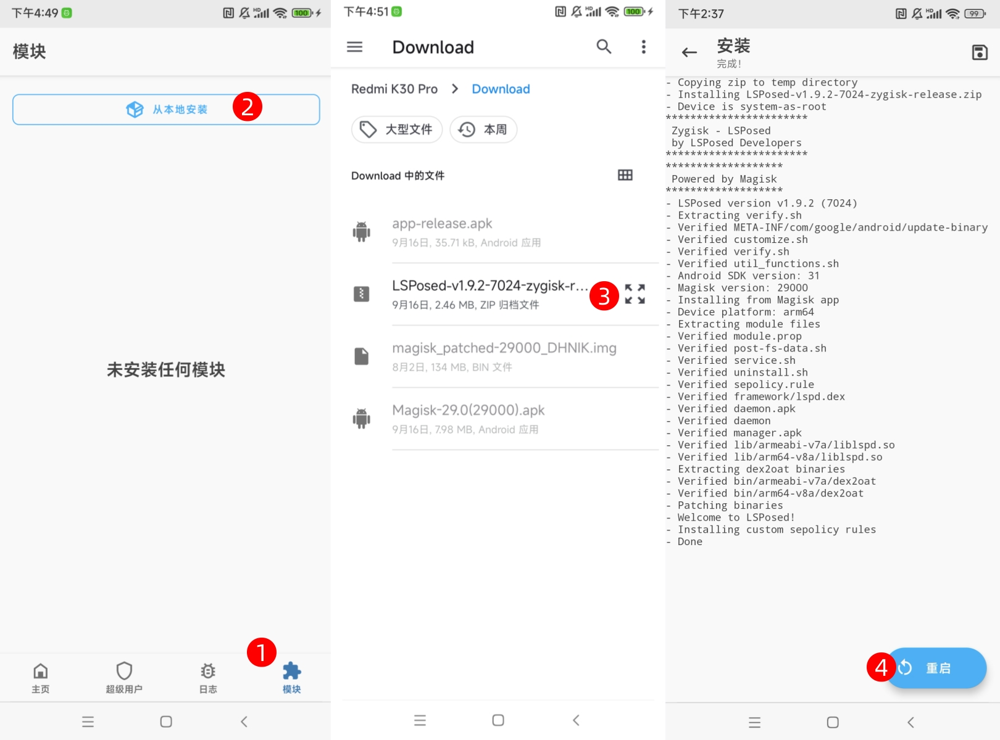
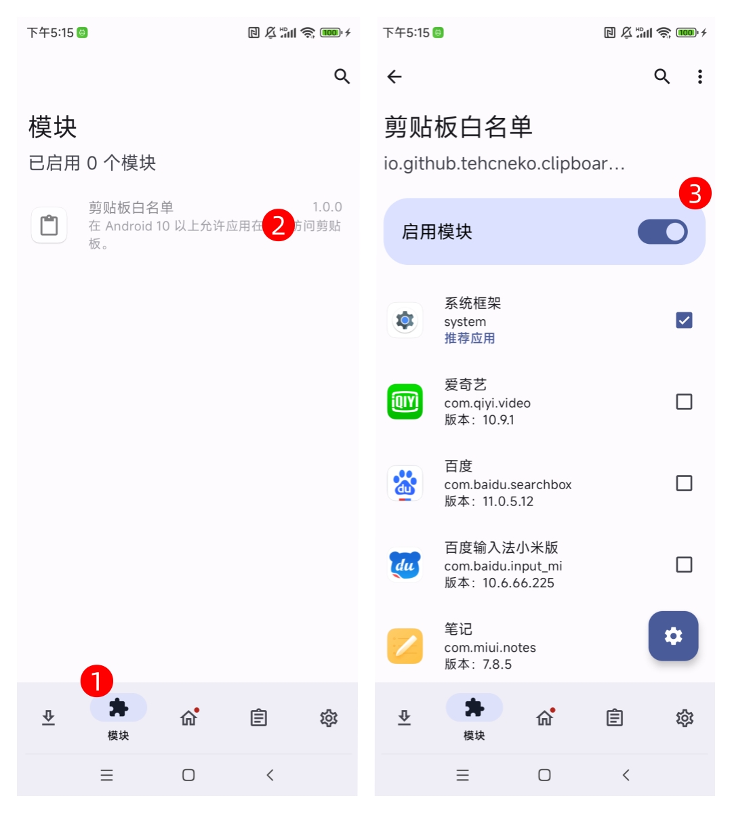
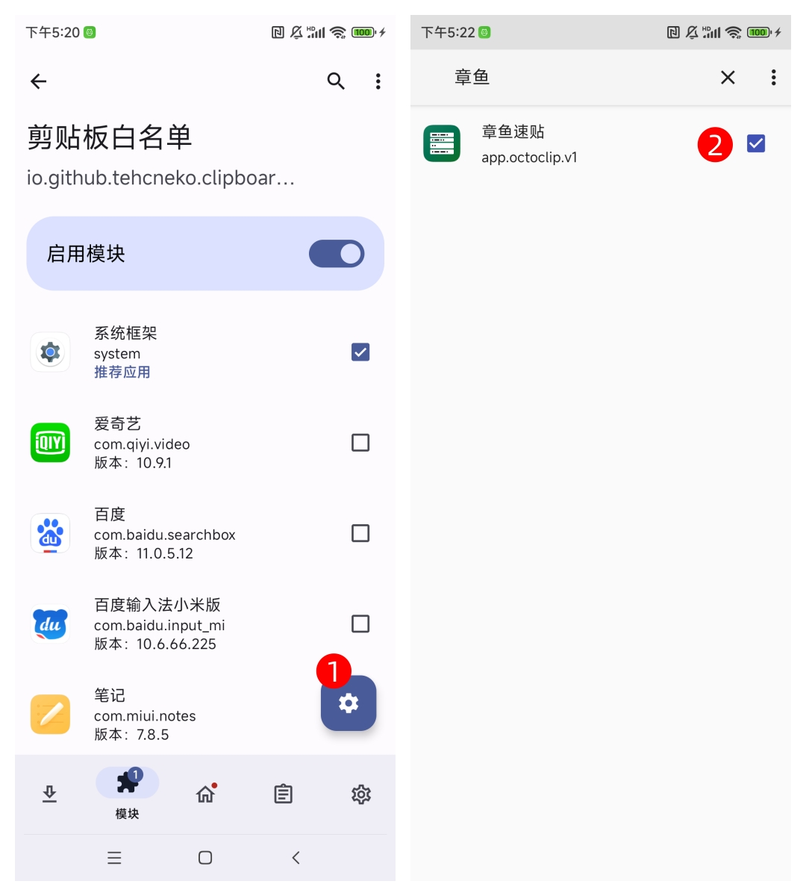
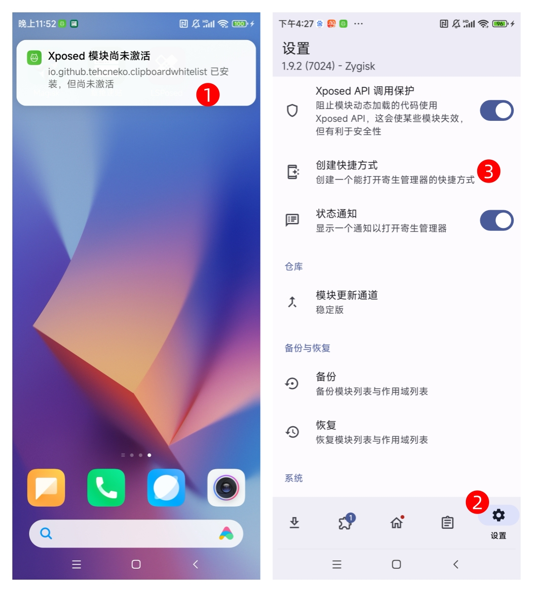

# 启用剪贴板后台监听（Root）

本教程将帮助已 Root 的用户，通过安装 LSPosed + 剪贴板白名单模块，启用剪贴板后台监听功能。

## 前置条件

> 必需条件

- 设备已Root，并已安装 **Magisk** v24.0 或更高版本
- 已在 Magisk 设置中启用 **Zygisk** 功能
- 已安装 **章鱼速贴** 应用

::: details 检查是否满足条件

1. 打开 Magisk 应用，确认显示"已安装"状态
2. 进入设置 → 确认 Zygisk 开关已开启
3. 重启设备使 Zygisk 生效

:::

<!-- ## 为什么选择这种方式?

- 兼容性：支持 Android 10+ 的所有版本，包括高版本系统。
- 稳定性：LSPosed 框架更新及时，适配广泛。
- 功能强大：结合剪贴板白名单 模块，支持后台监听和应用白名单配置。
- 简单易用: 无需复杂配置, 既可轻松启用。 -->

## 安装「LSPosed」框架

### 下载框架

你可以从[Github](https://github.com/LSPosed/LSPosed/releases)上自行下载，也可以直接点击 [此处](https://github.com/LSPosed/LSPosed/releases/download/v1.9.2/LSPosed-v1.9.2-7024-zygisk-release.zip) 下载。

### 安装框架

打开 **Magisk** 应用，切换到 **模块** 标签页，点击 **从本地安装** 按钮，选择下载的 LSPosed `.zip` 文件，等待安装完成，点击 **重启** 按钮。

## 安装「剪贴板白名单」模块

### 下载模块

你可以从[Github](https://github.com/Xposed-Modules-Repo/io.github.tehcneko.clipboardwhitelist/releases)上自行下载，也可直接点击 [此处](https://github.com/Xposed-Modules-Repo/io.github.tehcneko.clipboardwhitelist/releases/download/1-1.0.0/app-release.apk) 获取安装包。

### 启用模块

安装成功后，在 LSPosed 管理器的 **模块** 页面启用该模块

## 配置应用白名单

打开 **剪贴板白名单** 应用，找到并勾选 **章鱼速贴**

::: warning 应用列表读取权限提示
如果在剪贴板白名单应用中无法显示应用列表，请执行以下操作：

- 进入系统设置 → 应用管理 → 剪贴板白名单 → 权限
- 启用 **获取应用列表** 或 **读取应用信息** 权限
:::

## 重启并验证

1. **重启设备** 使配置生效
2. 打开 **章鱼速贴** 应用
3. 切换到任意其他应用，复制一段文字
4. 返回章鱼速贴，检查是否自动捕获到剪贴板内容

## 常见问题

**Q: 模块已安装但功能不生效怎么办？**

A: 请依次检查：

1. 确认 Zygisk 已启用，并重启过设备
2. 确认 LSPosed 管理器中已启用 剪贴板白名单 模块
3. 确认在 **两个位置** 都勾选了章鱼速贴：

   - LSPosed 模块作用域
   - 剪贴板白名单应用内

4. 尝试清除章鱼速贴应用数据后重新设置
5. 检查章鱼速贴已获取剪贴板访问权限

**Q: LSPosed 安装失败怎么办？**

可能原因：

- Magisk 版本过低（需要 v24.0+）
- Zygisk 未正确启用

解决方法：

1. 更新 Magisk 到最新版本
2. 重新启用 Zygisk 并完全重启设备

**Q: LSPosed 图标没有显示怎么办？**

1. 安装剪贴板白名单 APK 后，点击提示进入 LSPosed 模块
2. 在 LSPosed 内切换到 **设置** 标签页
3. 点击 **创建快捷方式** ，即可在桌面生成 LSPosed 图标

**Q: 剪贴板白名单无法显示应用列表？**

解决方法

1. 系统设置 → 应用管理 → 剪贴板白名单
2. 点击 **权限管理**
3. 开启 **获取应用列表** 或 **读取应用信息** 权限
4. 重新打开剪贴板白名单应用
