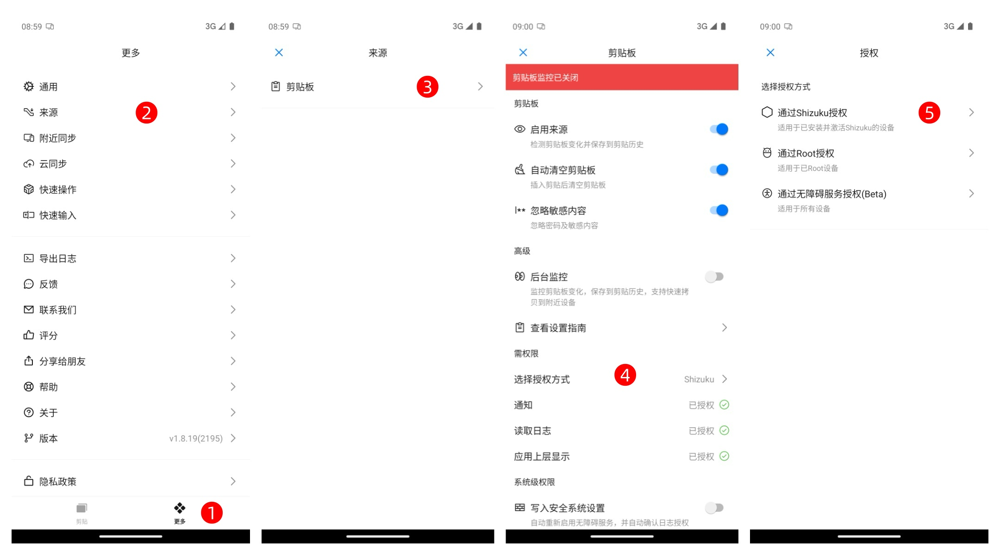
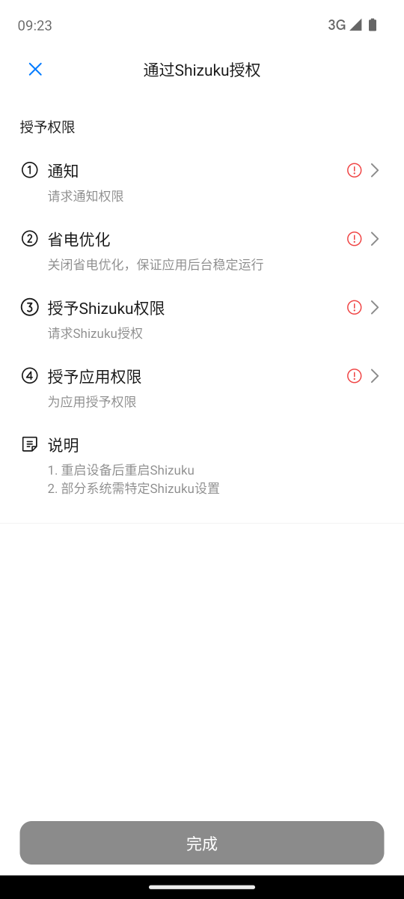
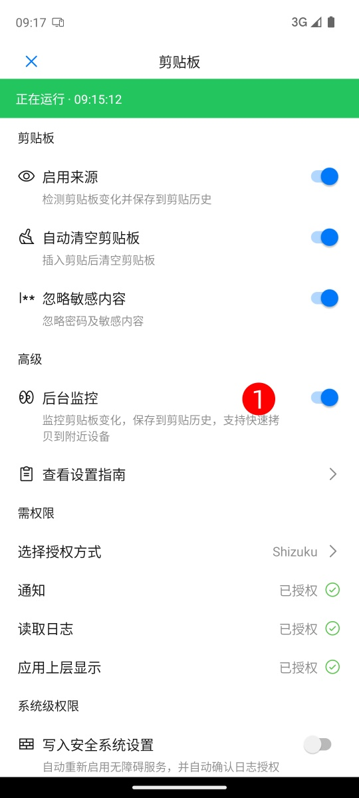
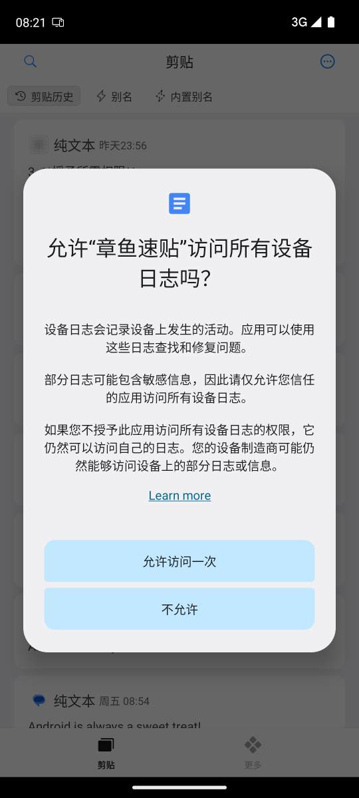

# 启用剪贴板后台监听（Shizuku）

本教程说明如何在**无需 Root** 的情况下，通过 **Shizuku 授权** 启用章鱼速贴的后台剪贴板监听功能。  
配置流程简洁，用户仅需在应用内按照引导完成即可。

## 一键配置流程

进入 **章鱼速贴 → 更多 → 来源 → 剪贴板 → 选择授权方式**。  
系统将自动跳转至「选择授权方式」页面。  

点击「通过 Shizuku 授权」进入授权引导流程。  

---

按照应用指引，依次完成下列操作：

1. **安装或更新 Shizuku**  

2. **激活 Shizuku 服务**  

3. **授予必要权限**  
   - 通知权限  
   - 关闭省电优化  
   - 授予 Shizuku 权限  
   - 授予应用权限  

   

4. 完成全部授权后，点击 **完成** 以激活剪贴板监听功能。

5. 打开「**后台监控**」开关，启用剪贴板后台监听。  

   

## 功能验证

1. 返回「章鱼速贴」主界面；  
2. 在任意其他应用中复制文本；  
3. 再次进入章鱼速贴，确认是否成功捕获剪贴板内容。  

## 常见问题（FAQ）

**Q: 已完成授权但仍未捕获剪贴板内容？**  
请确认在开启后台监听后，系统是否弹出日志授权请求对话框，并选择了“允许访问一次”。  
若未出现授权弹框，或权限未正确授予，请尝试以下操作：  

1. 重启设备
2. 打开章鱼速贴
3. 重新执行授权流程

---

**Q: 每次重启设备后是否需要重新授权？**  
设备重启后无需需重新启动 Shizuku 服务，但是需要打开章鱼速贴授予日志读取权限。

## 结语

完成上述步骤后，章鱼速贴将在 **Shizuku 授权模式** 下稳定运行，  
实现高可靠性的后台剪贴板监听与内容同步体验，具备接近系统级的性能与兼容性。
